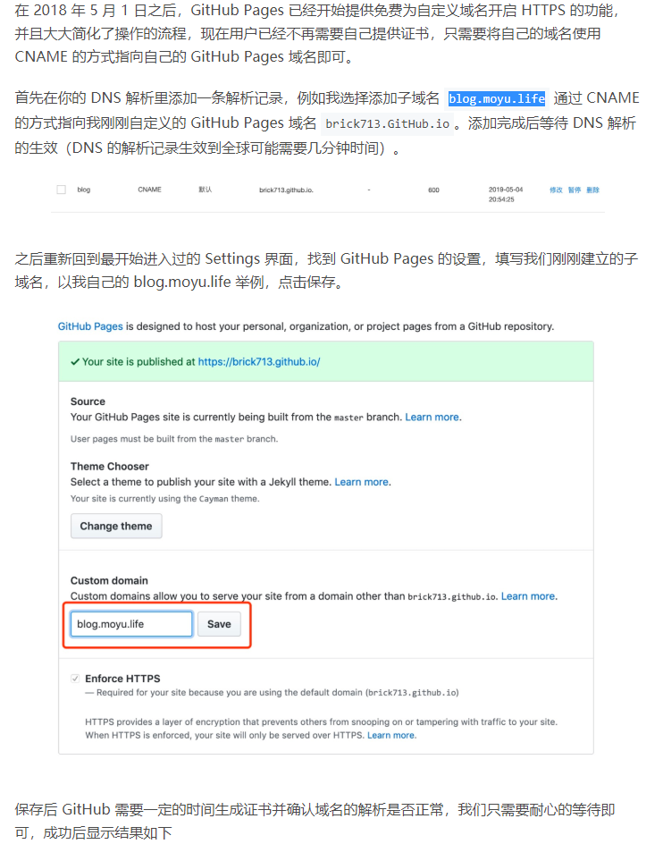

# GitPage简介

## GitPage是啥？

介绍托管在 GitHub 的项目一般是有个文件是README，但是像大型的项目需要复杂的、唯美的说明文档，所以GitHub提供了GitHub Page，针对说明文档发布静态的web页面（地址）。

***GitHub Pages可以被认为是用户编写的、托管在GitHub上的静态网页。***


因为博客基本都是一些文本，可以不用过多的数据，所以有很多的人使用GitHub Pages做博客。使用GitHub Pages的优点：

1. GitHub Pages有300M免费空间，资料自己管理，保存可靠(才300M??)
2. 可以自己制作博客的样式，也有很多的酷炫的博客效果可以借来使用
3. 类似自己的网站，B格满满
4. 操作方便，可以不需要服务器，跳过繁琐的服务器操作
5. 体验网站交互的感觉

## 搭建GitHub Pages方式

* 创建```${username}.GitHub.io```项目，GitHub将自动建立GitPage
* 除了GitGub外，国内有码云，提供了Gitee Pages，同样的功能
* 依附项目的Pages


### 依附于仓库项目的Pages

* 主要是根据仓库内容生成的Page


在```setting```中找到GitHub Pages项，默认没有配置显示如下


可以选择分支做GitHub Pages，可以选择主题


也可以配置域名，你自己要买域名解析，那是肯定的。如下示例：




如果已经完成了配置，会显示如下


仓库里面会多一个配置文件_config.yml


那么问题来了，
* 如果我有N个仓库，每个都要配置一下？对是的
* 如果我想统一风格咋办？选一样主题呗
* 如果我想自定义主题怎么办？谷歌一下，答案如下

 


---
