# hexo快速上手

## 安装git

* windows下安装 git bash
* ubuntu下apt-get install git -y
* centos下yum install git -y


## 安装nodejs

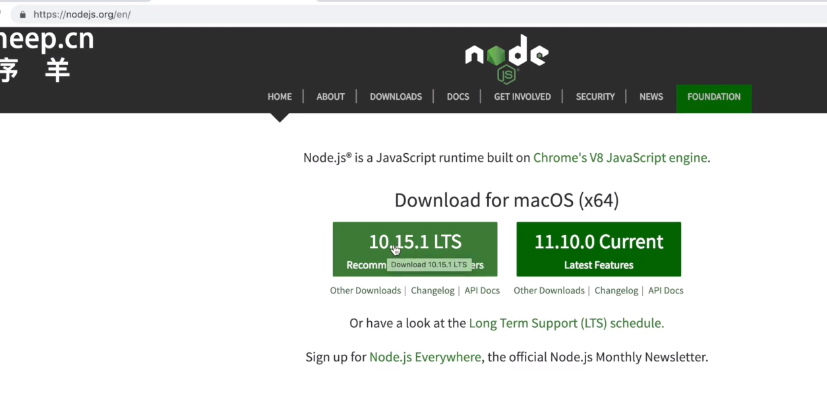

傻瓜安装nodejs，附带npm包管理。但是国内源比较尴尬，修改为淘宝镜像源

```
npm install -g cnpm --registry=https://registry.npm.taobao.org
```

后续可以事后cnpm代替npm进行软件安装

## cnpm安装hexo

```
cnpm install -g hexo-cli
```

安装完成后查看一下版本

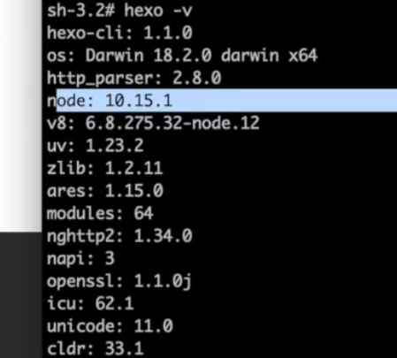

可以发现hexo是基于nodejs的

## hexo初始化博客

```
hexo init
或者
hexo init DIR
```

会自动git hexo默认仓库以及默认主题

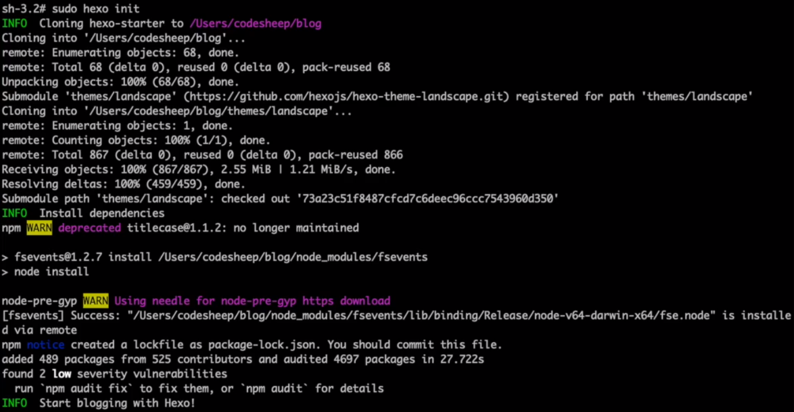

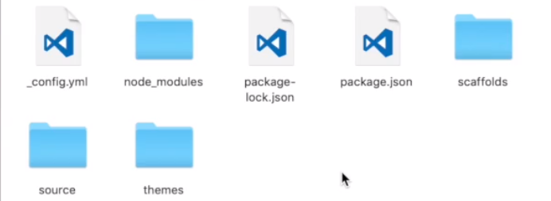

## hexo启动博客预览

```
hexo s
或者
hexo serve
```

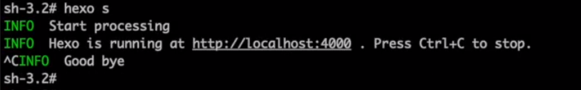

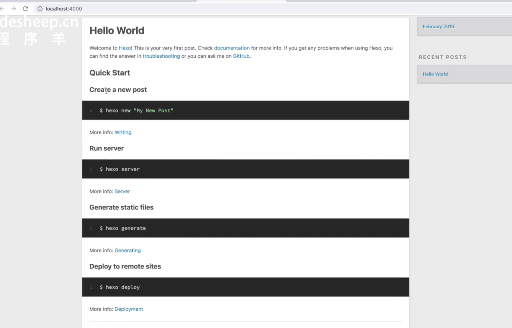

## hexo创建新文章

```
hexo new TITLE
```

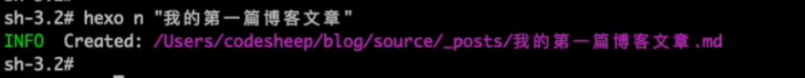

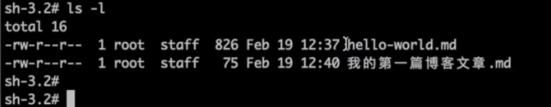


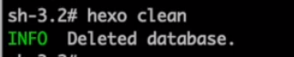

```
hexo  clean
```
清空生成后重新generate
```
hexo generate
```

## hexo博客远端部署


GitHub新建固定命名规范的仓库

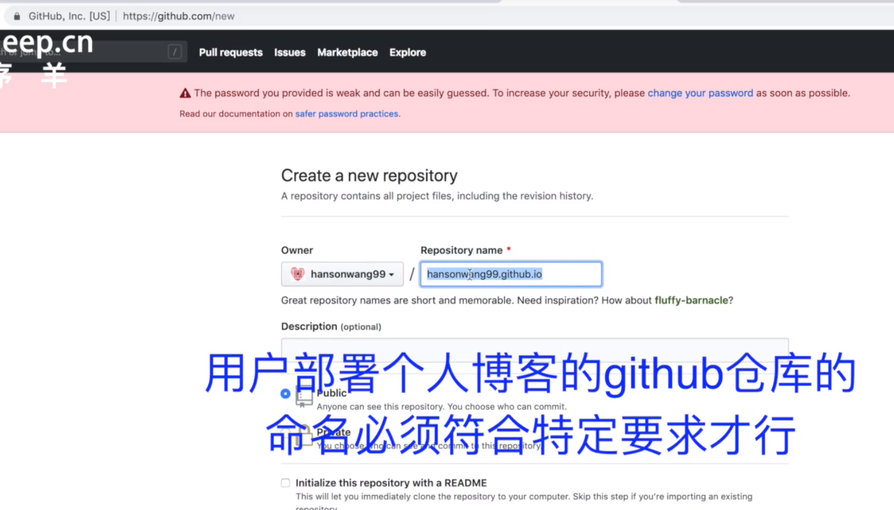

安装hexo-deployer-git包

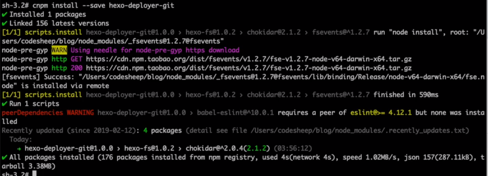


设置博客_config.yml文件

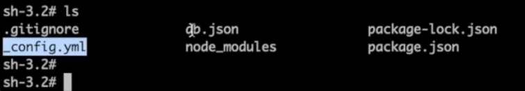

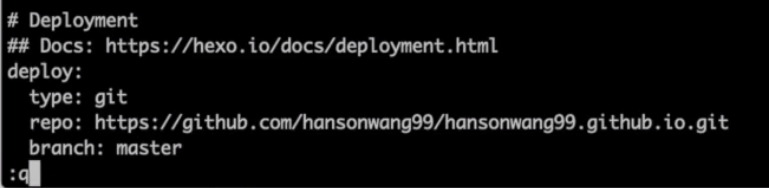

```
hexo deploy
```

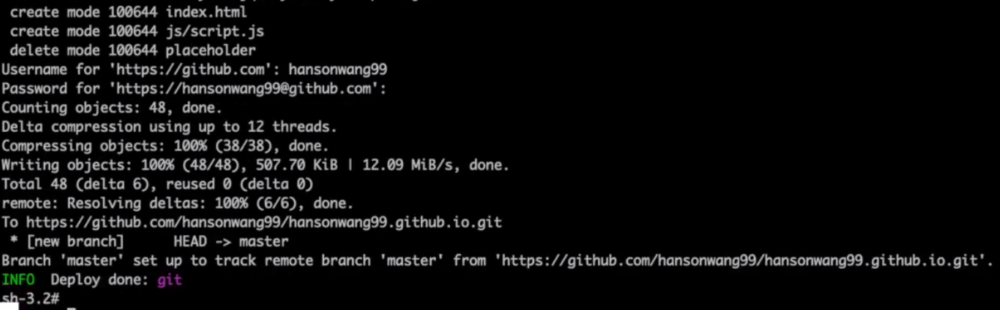

即可将仓库推送到GitHub

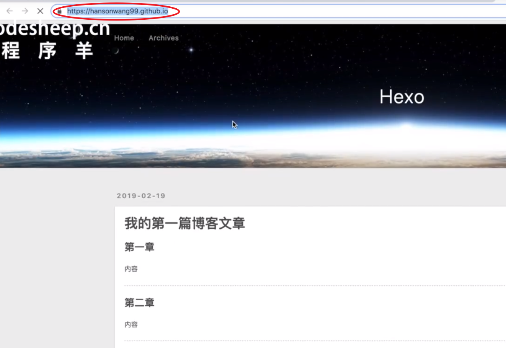

## 更换hexo默认主题

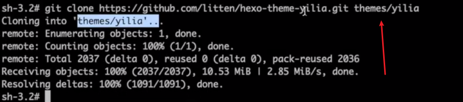

克隆新主题到themes目录下

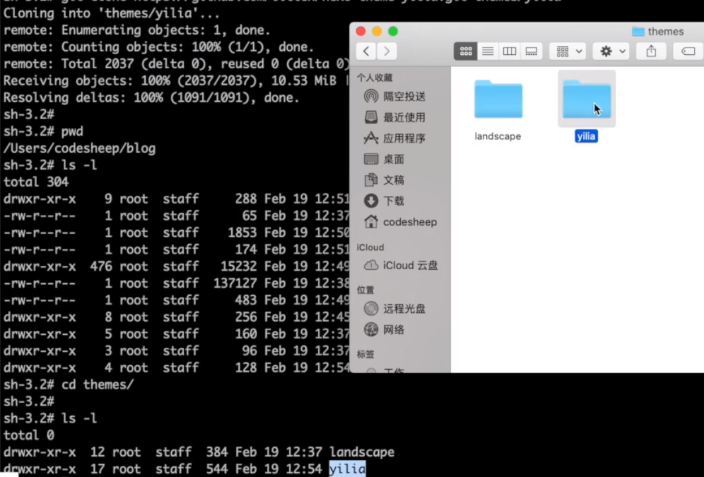

hexo默认主题landscape

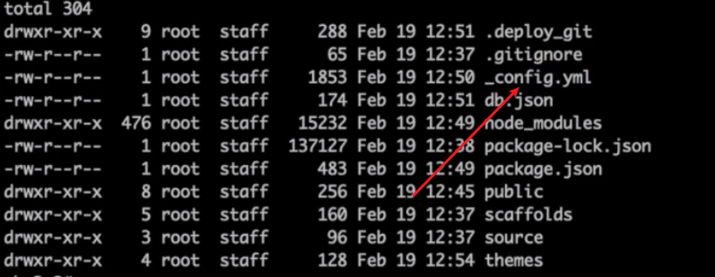

修改_config.yml配置

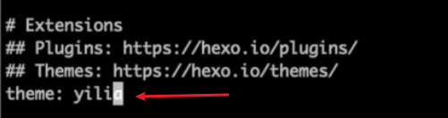

修改主题配置，重新```hexo clean```后```hexo generate```，浏览新主题页面

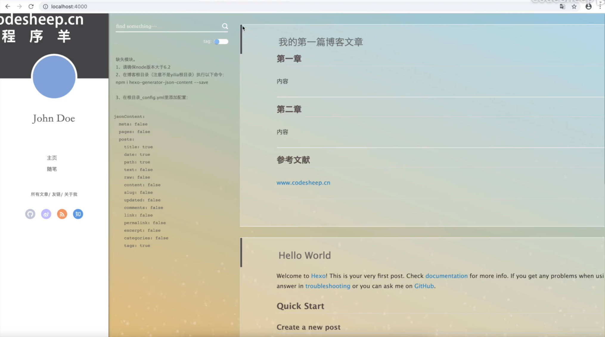


## npm常用命令


* npm init 对项目，包，做一个描述，第一步
* npm install x 安装x于项目
* npm install -g x 安装为全局变量
* npm install x --save 在pakage.jaon中显示所有的依赖项
* npm install x --save-dev
* npm install 安装本项目所有的依赖项。根据当前目录的packages.json文件
* npm uninstall xxx 卸载xxx
* npm run y 执行脚本里面的命令，y为键，值为在dos中可以执行的命令
* npm (run) start run可以省略不写
* npm login 登录npm账号
* npm publish 给npm官网发布你的包


## 参考

* <https://www.bilibili.com/video/av44544186?from=search&seid=2254004348553639637>
