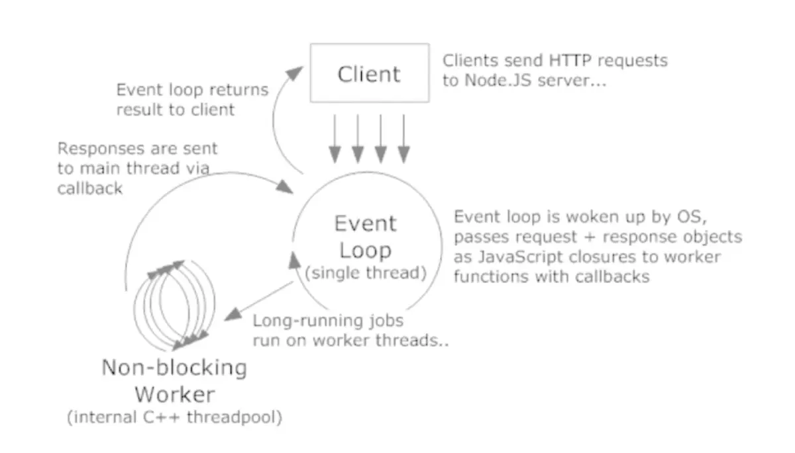

# nodejs简介

引用Node.js官方网站的解释如下：
```
Node.js  is a JavaScript runtime built on Chrome's V8 JavaScript engine. Node.js uses an event-driven, non-blocking I/O model that makes it lightweight and efficient.
```
翻译成中文就是：
```
Node.js 是一个基于 Chrome V8 引擎的 JavaScript 运行环境。
Node.js 使用了一个事件驱动、非阻塞式 I/O 的模型，使其轻量又高效。
```


## 运行环境(Runtime)

如果做一个类比，Node.js与JavaScript关系，就像JDK(Java Development Kit)与Java的关系。
总的来说，Node.js不是一门语言，而是用来进行Web开发的Runtime。

## 事件驱动(Event-driven)

在前端web开发中比较常见的事件驱动例子是，给一个按钮绑定一个事件处理程序，这个事件处理程序就是事件驱动的，JavaScript进程并不知道什么时候调用它，点击按钮，触发Click事件，此时主程序得到相应的通知，就知道调用绑定的的事件处理程序了。
因为Node.js是JavaScript的Runtime，所以天然就可以使用这种模式通知主进程的I/O 完成。

## 非阻塞式 I/O(Non-blocking I/O)

阻塞：I/O 时进程休眠等待 I/O 完成后进行下一步
非阻塞：I/O 时函数立即返回，进程不等待I/O 完成

## 工作原理

 

## 参考

* <https://www.jianshu.com/p/22f62a08559f>
