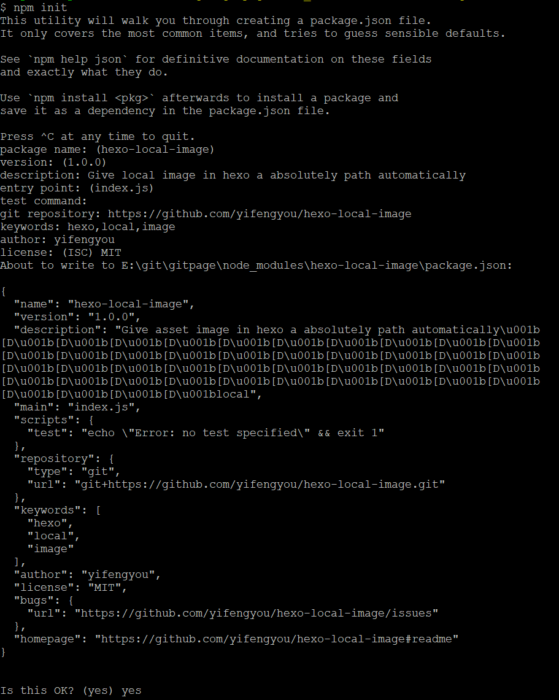

# npm使用

## 如何发布自己的npm包
```
npm init
```
初始化之后有好多配置




```
name：
模块名，之后发布之后就可以让用户npm install xxxx来引用你的开源模块了
version：
版本号，语义版本号分为X.Y.Z三位，分别代表主版本号、次版本号和补丁版本号。当代码变更时，版本号按以下原则更新。
如果只是修复bug，需要更新Z位。
如果是新增了功能，但是向下兼容，需要更新Y位。

如果有大变动，向下不兼容，需要更新X位。

description：
简单介绍自己的模块

main：
入口文件，必要，当通过require('xxx')时，是读取main里声明的文件

test command：
测试命令

git repository：
git仓库地址

keywords：
关键词，可以通过npm搜索你填写的关键词找到你的模块

author：
作者信息，可以之后编辑更详细一些

license（ISC）：
代码授权许可 可以参考这里
```

以上放心可以大胆写，因为之后反正要改。初始化项目完成，可以看到目录中出现了一个叫 package.json 的文件


---
